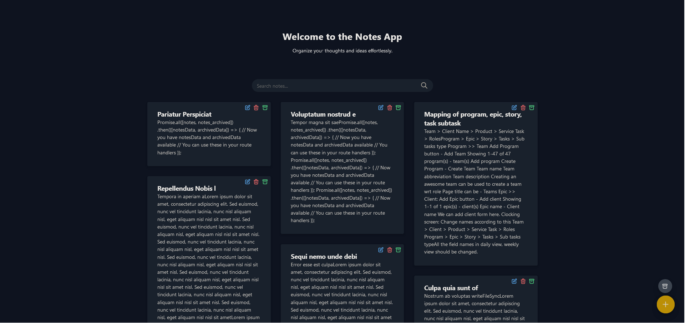
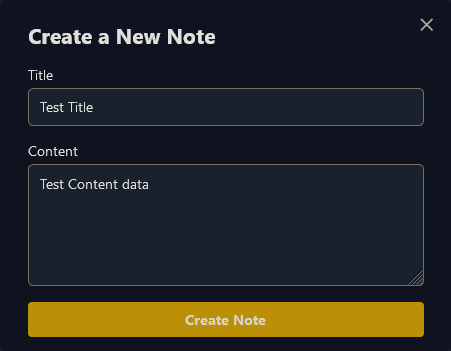

# Notes App

A simple web-based notes application built with Node.js and Express.

This application allows users to efficiently manage their notes with a clean and intuitive interface. Users can create, edit, delete, and organize their notes with ease.

Key features include:
- Create new notes with a title and content
- Edit existing notes to keep information up-to-date
- Delete notes that are no longer needed
- Archive notes to keep your main view clutter-free
- Unarchive notes when you need to access them again
- Search functionality to quickly find specific notes

The app provides a seamless experience for keeping track of your thoughts, ideas, and important information. Whether you're a student, professional, or anyone who likes to stay organized, this Notes App is designed to meet your note-taking needs.

You can access the live application at [https://notes-app-819b.onrender.com/](https://notes-app-819b.onrender.com/).

## Features

- Create, read, update, and delete notes
- Archive and unarchive notes
- Search functionality
- Static file serving

## Prerequisites

- Node.js
- npm (Node Package Manager)

## Installation

1. Clone the repository:
~~~bash
git clone https://github.com/yourusername/notes-app.git 
~~~

2. Install dependencies:
~~~bash
cd notes-app
npm install 
~~~

3. Run the application:
~~~bash
node server.js
~~~

4. Open your web browser and navigate to `http://localhost:3000`

## API Endpoints

- `GET /`: Home page
- `POST /create`: Create a new note
- `POST /update/:id`: Update an existing note
- `DELETE /delete/:id`: Delete a note
- `POST /archive/:id`: Archive a note
- `POST /unarchive/:id`: Unarchive a note
- `GET /search`: Search for notes

## Project Structure

- `server.js`: Main application file
- `data/`: Directory for storing active notes
- `archived/`: Directory for storing archived notes
- `public/`: Directory for static files
- `views/`: Directory for EJS templates

## Dependencies

- express
- ejs
- ejs-layouts

## License

This project is licensed under the MIT License.
